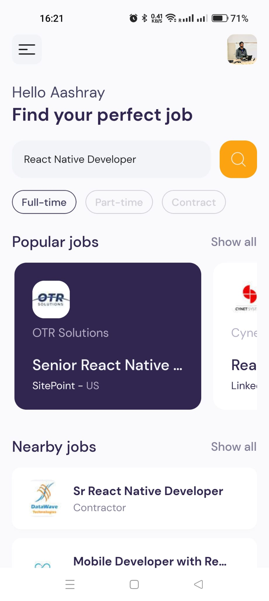

# job_hunt
A React Native App to ease your job hunting journey by collecting data from Google directly.

## Screenshots

Home Page           |  Details Page 
:-------------------------:|:-------------------------:
|  |  

## Features

- Job Searching
- Filters based on Job Type
- Job Details
- Option to Apply for job

## Requirements

- Node.js 20.0 or later
- Expo 51.0 or later

## Installation

1. Clone the repository:

   ```bash
   git clone https://github.com/aashraybavisa/job_hunt.git
   ```

2. Install dependencies

   ```bash
   npm install
   ```

3. Start the app

   ```bash
    npx expo start
   ```

In the output, you'll find options to open the app in a

- [development build](https://docs.expo.dev/develop/development-builds/introduction/)
- [Android emulator](https://docs.expo.dev/workflow/android-studio-emulator/)
- [iOS simulator](https://docs.expo.dev/workflow/ios-simulator/)
- [Expo Go](https://expo.dev/go), a limited sandbox for trying out app development with Expo

You can start developing by editing the files inside the **app** directory. This project uses [file-based routing](https://docs.expo.dev/router/introduction).

## Usage

1. Launch the app.
2. Use the Search button to search for a job title with location.
3. Click on Popular and Nearby jobs to get the result directly.
4. Click on "Apply for job" button to Apply on that job posting.

## Contributing

Contributions are welcome! Please create a pull request with a detailed description of your changes.

## License

This project is licensed under the MIT License. See the `LICENSE` file for more details.


--> Developed by [Aashray Bavisa](https://www.linkedin.com/in/aashray-bavisa/).
